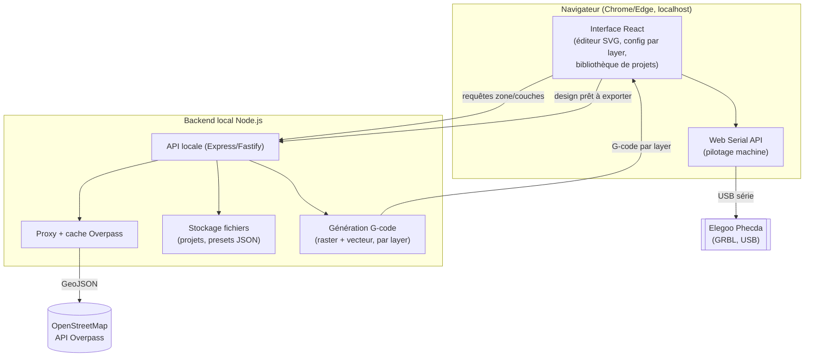

# Cahier des charges — AppLaser

## 1. Contexte et objectif

Application web personnelle destinée à piloter et préparer des travaux pour une graveuse laser **Elegoo Phecda** (10W/20W), dans un cadre d'usage hobby/atelier personnel.

Objectif : permettre d'importer un design (image, SVG, DXF), de le préparer (positionnement, réglages puissance/vitesse), de générer le G-code correspondant, et de gérer une bibliothèque de projets et de presets matériaux — sans dépendre exclusivement de LightBurn/LaserGRBL.

Fonctionnalité phare : un générateur de **cartes de ville multi-couches en bois**, dans l'esprit des maquettes cartographiques vendues dans le commerce (plaques superposées, plans d'eau en découpe laissant apparaître une plaque de fond colorée, routes gravées/découpées en relief). Voir section 4.1.

## 2. Matériel cible

| Caractéristique | Valeur |
|---|---|
| Machine | Elegoo Phecda |
| Puissance | 10W ou 20W (selon version) |
| Zone de gravure | 400 x 400 mm |
| Firmware | GRBL |
| Vitesse max | 25 000 mm/min |
| Spot focal | 0,07 x 0,13 mm (10W : 0,06 x 0,06 mm) |
| Connectivité | USB (série), Wi-Fi, carte TF/microSD, app mobile |
| Logiciels compatibles connus | LightBurn, LaserGRBL |

Conséquence technique : l'application doit pouvoir dialoguer en GRBL (commandes G-code standard + $-commands) via port série (USB) et, si possible, via Wi-Fi.

## 3. Utilisateurs et contexte d'usage

- Usage personnel, mono-utilisateur (pas de gestion de comptes/rôles dans un premier temps).
- Utilisation depuis un poste de travail (PC/Mac) connecté à la machine, dans un même réseau local ou via câble USB.
- Pas de contrainte de production industrielle ; priorité à la simplicité d'usage et à la fiabilité du pilotage.

## 4. Périmètre fonctionnel

### 4.1 Générateur de cartes multi-couches (fonctionnalité phare)

Inspiré des maquettes cartographiques en bois du commerce (ex. carte de Pavia en illustration) : une carte de ville découpée/gravée sur plusieurs plaques de bois superposées, où les plans d'eau et les axes routiers apparaissent en relief par jeu de découpes traversantes révélant les couches inférieures.

**Source des données géographiques**
- Par défaut : récupération automatique via **OpenStreetMap** (API Overpass) — rues, plans d'eau, parcs, voies ferrées, etc.
- Alternative : import manuel d'un fichier GeoJSON/SVG déjà préparé par l'utilisateur, pour les cas où OSM ne convient pas ou pour retoucher des données.

**Sélection de la zone**
- Carte interactive (type Leaflet/MapLibre) permettant de naviguer et de positionner/redimensionner un cadre ajustable qui définit précisément la zone géographique à découper.
- **Format personnalisable** : l'utilisateur définit librement les dimensions de la plaque visée (largeur x hauteur en mm), dans la limite de la zone de travail de la machine (400x400mm max sur la Phecda) ; le cadre s'ajuste en conséquence.

**Structure des couches — exactement 3 plaques physiques superposées**
1. **Layer 1 — Fond** : plaque pleine (uniquement le contour extérieur découpé). Laissée neutre ou peinte en bleu par l'utilisateur après fabrication ; elle marque les plans d'eau par transparence à travers la découpe de la couche du dessus. Aucun autre élément sur cette plaque.
2. **Layer 2 — Intermédiaire** : **gravure** de surface pour les routes secondaires/départementales + éléments optionnels sélectionnables (parcs, voies ferrées, chemins, etc.), et **découpe traversante** des plans d'eau (rivières, lacs, mer) pour laisser apparaître le Layer 1 (fond bleu) en dessous.
3. **Layer 3 — Supérieure** : **découpe uniquement** (pas de gravure) des grands axes routiers/autoroutes, **fusionnée avec le cadre et le titre** — cadre, nom de ville et routes principales sont sur la même plaque/le même export, il n'y a pas de plaque "cadre" séparée.

**Workflow de configuration — layer par layer**
- L'utilisateur configure les couches une par une dans l'interface : pour chaque layer, il sélectionne les types d'éléments OSM à inclure (ex. Layer 2 : routes secondaires toujours incluses + cases à cocher parcs / voies ferrées / chemins ; Layer 3 : routes principales).
- Aperçu visuel indépendant par layer pendant la configuration, avant export.

**Cadre, titre et coordonnées (sur le Layer 3)**
- Le nom de la ville est **intégré et découpé/gravé en relief dans le cadre** du Layer 3.
- Le titre est **librement repositionnable et orientable** (déplacement + rotation) dans la zone du cadre, plutôt que fixé à un emplacement unique.
- **Police et taille du texte configurables** : choix de la police d'écriture (parmi une liste de polices adaptées à la gravure/découpe laser — mono-trait ou pleines selon le rendu voulu) et réglage de la taille du texte, pour le titre comme pour les coordonnées.
- **Coordonnées GPS optionnelles** : activables via un **décalage (offset)** qui agrandit le cadre d'un côté pour dégager la place nécessaire à leur affichage (plutôt que deux styles de cadre distincts) ; désactivées, le cadre reste au plus près de la carte.
- **Bords arrondis du cadre** : rayon configurable indépendamment pour le **contour extérieur (outer)** et le **contour intérieur (inner)** du cadre.

**Export**
- Chaque layer est généré et exporté séparément (aperçu SVG + G-code dédié) : 3 layers = 3 fichiers = 3 jobs = 3 plaques de matériau (le cadre/titre étant inclus dans l'export du Layer 3, pas de 4ᵉ fichier).
- Pas de système d'alignement automatisé prévu dans le MVP (cf. décision utilisateur) : l'utilisateur gère lui-même le calage physique des plaques entre elles (un simple contour de référence commun à chaque layer suffit à guider l'empilement).
- Réglages puissance/vitesse/passes indépendants par layer, avec presets dédiés à la cartographie (ex. "contreplaqué 3mm — gravure route", "contreplaqué 3mm — découpe fine plan d'eau").

**Niveau de détail des données OSM**
- **Réglage manuel** : un curseur "niveau de détail" (simplification des tracés, réduction du nombre de points par courbe) ajustable par l'utilisateur, avec aperçu en direct du rendu avant export — pas d'automatisation cachée, l'utilisateur voit et contrôle le résultat.
- Combiné à la sélection des types de voies par layer déjà prévue (section "Workflow de configuration") pour exclure les éléments non désirés (ex. petites allées piétonnes) en plus de la simplification géométrique.

### 4.2 Import et préparation de design générique
- Import d'images matricielles (PNG, JPG) pour gravure trame (raster).
- Import de fichiers vectoriels SVG pour découpe/gravure vectorielle.
- Import de fichiers DXF.
- Positionnement, redimensionnement et rotation du design sur un aperçu de la zone de travail (400x400mm).
- Réglages par calque/objet : puissance (%), vitesse (mm/min), nombre de passes, mode (gravure trame / découpe vectorielle / marquage ligne).

### 4.3 Génération de G-code
- Génération de G-code compatible GRBL à partir du design préparé (que ce soit issu du module cartes ou de l'import générique).
- Aperçu du G-code généré et estimation du temps d'exécution.
- Export du G-code (fichier .gcode/.nc) pour utilisation via carte SD si besoin.

### 4.4 Bibliothèque de projets et presets
- Sauvegarde/chargement de projets (design + réglages), y compris les projets cartographiques (zone, cadre, couches, réglages par couche).
- Bibliothèque de presets matériaux, éditable par l'utilisateur. **Un seul preset par défaut au lancement : peuplier 3mm** (le reste de la bibliothèque se construit au fur et à mesure de l'usage).

**Preset par défaut — Peuplier 3mm (valeurs de départ à ajuster par test sur votre machine)**

| Mode | Puissance | Vitesse | Passes |
|---|---|---|---|
| Découpe | 70-95 % | 800-1000 mm/min | 2 |
| Gravure | 45-65 % | 2800-3500 mm/min | 1 |

*Ces valeurs sont des points de départ issus de retours d'expérience communautaires sur laser diode 10-20W, pas une garantie — le réglage réel dépend du lot de bois et de l'usure de la diode. Une mire de test (cf. section 9) reste recommandée à chaque nouvelle plaque.*

### 4.5 Pilotage machine (contrôle direct)
- Connexion série USB à la machine (GRBL).
- Envoi du G-code généré directement à la machine, avec suivi de progression.
- Contrôles de base : jog (déplacement XY), homing, définition de l'origine de travail, cadrage laser (préverrouillage de la zone à faible puissance), pause/reprise/arrêt d'urgence.
- Affichage des retours GRBL (statut, alarmes, erreurs).

### 4.6 Hors périmètre MVP (évolutions possibles)

- Connexion Wi-Fi directe à la machine — MVP en USB uniquement, Wi-Fi retenu comme évolution v2 confirmée (protocole d'intégration à étudier le moment venu).
- Multi-utilisateurs / comptes / partage de projets.
- Génération automatique de trajectoires d'optimisation avancées (nesting, tri-tramage complexe).
- Support d'autres machines/firmwares que GRBL.
- Application mobile native (le web restera responsive mais pas d'app dédiée).
- Système d'alignement/calage automatisé entre plaques du module cartes (le calage physique reste manuel dans le MVP).
- Gestion de couches supplémentaires au-delà des 3 plaques définies (bâtiments en relief, courbes de niveau, etc.).

## 5. Exigences non fonctionnelles

- **Sécurité d'usage** : confirmation obligatoire avant tout lancement de gravure/découpe ; bouton d'arrêt d'urgence toujours accessible à l'écran pendant un job ; rappel visuel des risques laser (classe 4).
- **Fiabilité** : la perte de connexion série pendant un job doit être détectée et signalée clairement, sans corruption du projet.
- **Performance** : génération de G-code pour un design raster 400x400mm en moins de quelques secondes sur un poste standard.
- **Portabilité** : application web utilisable sur les navigateurs modernes (Chrome/Edge/Firefox) sous Windows/Mac/Linux. L'accès au port série nécessite un navigateur compatible Web Serial API (Chrome/Edge).
- **Données locales** : les projets et presets doivent être conservés localement (pas d'obligation de compte cloud dans le MVP).

## 6. Architecture technique

Décisions validées avec l'utilisateur :

| Choix | Décision |
|---|---|
| Frontend | React + TypeScript + Vite |
| Backend | Node.js léger (Express ou Fastify), lancé en local en même temps que le frontend |
| Rendu carte/design | SVG (chaque route, plan d'eau, cadre, texte = élément SVG manipulable individuellement) |
| Déploiement | Local uniquement (`localhost`), pas d'accès réseau dans le MVP |
| Communication machine | Web Serial API, depuis le navigateur, direct vers la Phecda en USB |

### 6.1 Schéma des modules

### 6.2 Répartition des responsabilités

**Frontend (React + TS)**
- Interface de configuration layer par layer (sélection zone, éléments OSM par couche, réglages puissance/vitesse/passes).
- Éditeur SVG du cadre/titre (drag, rotation, police, taille, bords arrondis, décalage coordonnées).
- Bibliothèque de projets/presets (consultation, édition — les données vivent côté backend).
- Pilotage machine via Web Serial API (jog, homing, envoi G-code, suivi de progression, arrêt d'urgence) — **en direct depuis le navigateur**, sans passer par le backend, pour minimiser la latence de contrôle.

**Backend (Node.js local)**
- Proxy + cache des requêtes Overpass (respect des limites de débit de l'API publique OSM, réutilisation des résultats déjà téléchargés pour une même zone).
- Traitement des données géographiques : nettoyage, simplification des tracés, découpage par layer selon la sélection utilisateur.
- Génération du G-code (raster pour les images importées, vectoriel pour SVG/DXF/couches cartographiques) à partir du design validé côté frontend.
- Stockage des projets et presets en fichiers locaux (JSON), lisibles/sauvegardables facilement par l'utilisateur.

**Pourquoi le Web Serial API reste côté frontend et non backend** : passer par le backend ajouterait un saut réseau inutile pour du pilotage temps réel (jog, arrêt d'urgence) sur une machine déjà branchée en USB au même poste ; le navigateur communique directement avec le port série.

*Le détail des formats d'échange (schéma JSON des projets, structure du G-code par layer) sera précisé en phase de conception détaillée.*

## 7. Contraintes

- Le pilotage machine en direct depuis le navigateur dépend du support de la Web Serial API → limite l'usage à des navigateurs Chromium sur desktop pour cette fonctionnalité (l'import/génération de G-code restent utilisables partout).
- Zone de travail fixe à 400x400mm à respecter dans l'aperçu et les contrôles de bornes.
- Laser de classe 4 : l'application ne doit jamais lancer un job sans confirmation explicite de l'utilisateur.

## 8. Critères d'acceptation (MVP)

1. L'utilisateur peut importer une image ou un SVG et le positionner sur un aperçu fidèle de la zone 400x400mm.
2. L'utilisateur peut définir puissance/vitesse/passes et générer un G-code valide, exécutable sur la Phecda.
3. L'utilisateur peut sauvegarder un projet et le retrouver plus tard avec tous ses réglages.
4. L'utilisateur peut choisir un preset matériau et l'appliquer à son design.
5. L'utilisateur peut se connecter en USB à la machine, envoyer le G-code, suivre la progression, et arrêter le job à tout moment.

## 9. Points de vigilance techniques (bonnes pratiques du secteur)

Liste de contrôle issue des retours d'expérience courants sur la découpe/gravure laser et les cartes multi-couches, à garder en tête pendant la conception et avant chaque production.

**Préparation des données / fichiers**
- [ ] Nettoyer/simplifier les données OSM avant génération : les exports bruts peuvent contenir des milliers de segments inutiles ; filtrer par type de voie et appliquer une tolérance de simplification (ex. Douglas-Peucker).
- [ ] Détecter et corriger les auto-intersections de tracés issues d'OSM avant conversion en G-code — sinon trajectoires incohérentes ou boucles parasites.
- [ ] Toujours convertir le texte (titre, coordonnées) en tracés vectoriels (paths) avant export — ne jamais envoyer du texte "live" (police système) au laser.

**Petites pièces isolées ("îlots") et fragilité**
- [ ] Repérer les éléments qui deviendraient des pièces détachées après découpe (petite île, tronçon de route isolé en bord de plaque) et les fusionner avec une pièce voisine, ou basculer en gravure plutôt qu'en découpe pour ces cas précis.
- [ ] Traiter les ponts comme faisant partie de la couche "route/terre", jamais comme un élément flottant dans la couche "eau".
- [ ] S'assurer que le cadre du Layer 3 englobe bien les extrémités des routes qui touchent le bord de la plaque, pour qu'elles ne se détachent pas au découpage.
- [ ] Éviter les traits de découpe trop rapprochés (bois fragilisé, risque de casse à la manipulation).

**Cadre et texte**
- [ ] Vérifier une largeur de trait minimale pour la découpe (police trop fine = risque de casse).
- [ ] Garder une marge de sécurité entre texte/cadre et le bord de la plaque.

**Kerf (largeur du trait laser)**
- [ ] Faire un test de kerf avant un projet important : le kerf varie avec la puissance/vitesse/matériau, et diffère parfois d'une plaque de contreplaqué à l'autre (variabilité du bois).
- [ ] Prévoir, à terme, une compensation de kerf configurable si des pièces doivent s'emboîter précisément.

**Réglages matériau (puissance/vitesse)**
- [ ] Toujours faire une mire de test puissance x vitesse (grille 4x4 ou 5x5) sur une chute avant de lancer la pièce finale, en particulier à chaque changement de lot/fournisseur de contreplaqué.
- [ ] Privilégier un contreplaqué "qualité laser" (bouleau baltique) : le contreplaqué de grande surface a des poches de colle interne qui perturbent la découpe.
- [ ] Activer l'air assist pour limiter le noircissement des bords et les flare-ups sur le bois.
- [ ] Envisager un ruban de masquage/transfert sur la surface avant gravure pour limiter les traces de fumée.

**Sécurité machine**
- [ ] Ne jamais laisser la machine sans surveillance pendant un job (un feu peut démarrer en quelques secondes sur du bois).
- [ ] Ventilation dédiée vers l'extérieur (un simple filtre à charbon ne suffit pas en usage prolongé).
- [ ] Extincteur à proximité immédiate de la machine, vérifié et à jour.
- [ ] Nettoyage régulier des optiques (lentille, miroirs) et du ventilateur — poussières/résidus inflammables.
- [ ] Utiliser une grille nid d'abeille pour maintenir le matériau à plat et limiter les étincelles.

**Assemblage final**
- [ ] Prévoir des repères d'alignement (petites marques gravées, cachées sous le cadre une fois assemblé) sur chaque couche pour faciliter le collage.
- [ ] Laisser sécher chaque couche collée avant d'ajouter la suivante, plutôt que d'empiler et coller en une fois.
- [ ] Nommer/organiser clairement les fichiers exportés par couche pour éviter toute confusion au moment de l'envoi à la machine.

## 10. Points ouverts à trancher avec l'utilisateur

Aucun point ouvert à ce stade — tous les points identifiés ont été tranchés (voir historique des décisions ci-dessus). De nouveaux points pourront apparaître au fil de la conception détaillée et seront ajoutés ici.
